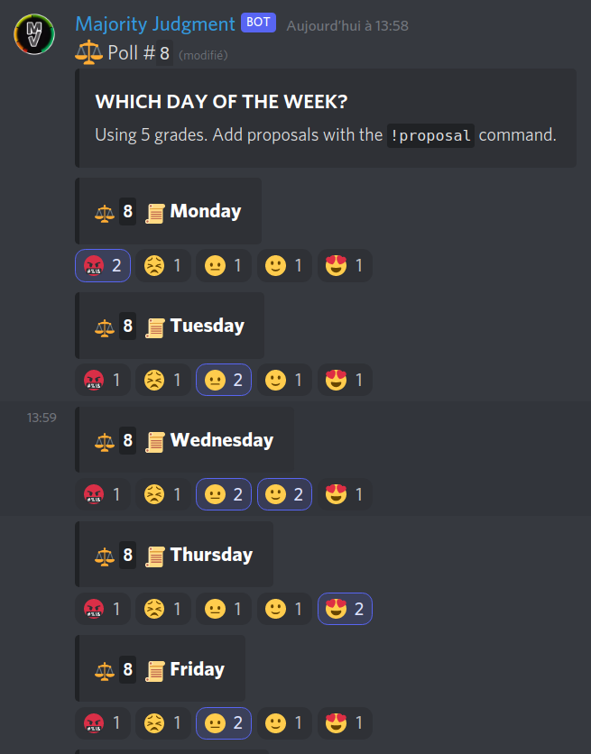

# Majority Judgment Discord Bot

Made with [Nimda](https://github.com/JABirchall/NimdaDiscord), ❤, [Yasmin](https://github.com/CharlotteDunois/Yasmin).

> Here is for example what `!poll week` generates:

## Usage

The bot responds to the following commands:

- `!join` to let the bot join a channel _(required, admin only)_
- `!leave` to make the bot leave a channel _(admin only)_
- `!poll` to create a new poll in the current channel
- `!proposal` to suggest a proposal for a previously created poll
- `!result` to show the results of the latest poll of the channel

**Anyone** may issue `!poll`, `!proposal` and `!result` commands to the bot, see issue [#3](https://github.com/MieuxVoter/majority-judgment-bot-nimda-discord/issues/3).
Join us in specifying how the bot should handle this, by describing your needs.

## Disclaimer

We're running this bot with a potato and a dream.

It is not yet ready for thousands of kids spamming a channel with commands.

It should work fine if your community is small and well-behaved.

We're not even confident it does not leak memory.  So far so good…
If you know how to review for memleaks, Merge Requests are most welcome! 

## Install MieuxVoter's bot

1. Join [our chat](https://discord.gg/rAAQG9S)
2. Ask a member (_@Hirondelle_) for the link to the bot
3. Accept that the bot comes without guarantees and this is beta
3. Follow the link to Discord's private wonderland
4. Type `!poll` in your channel
5. Consider making a small donation to MieuxVoter
6. Report/fix bugs, suggest/make improvements, etc.

## Make your own bot

To install this bot, clone/download this repository.

Copy the `.env` to `.env.local`, and edit it with your preferences and Discord secret token
that you can get over there by jumping some hoops :
https://discordapp.com/developers/applications/

    cp .env .env.local

The `.env.local` file is ignored by git, so you won't commit your secrets by mistake.

Edit the configuration files in `/Nimda/Configuration` as needed. 

Then, install [Composer](https://getcomposer.org/) and run:

    composer install

Once all packages are installed, run `php start.php`.

## Prerequisites

* PHP version `^7.1`
* PHP `PDO` extensions, and `sqlite`
* PHP `mbstring` extension
* A discord bot token

## Authors

This bot is one of many projects of [MieuxVoter.fr](https://mieuxvoter.fr).

### Bot Authors

* **Hirondelle** - *Ninjaaa!*
* **Roipoussiere** - *Knight*
* **Vesporium** - *Magus*

### Framework Authors

* **JABirchall** - *Maintainer, Bot base, plugin system, timers*
* **Thurston** - *Intern, events*
* **[CharlotteDunois](https://github.com/CharlotteDunois)**

## License

This project is licensed under `GNU AGPLv3` License - see the [LICENSE](./LICENSE.md) file for details.

## Acknowledgments

* [MieuxVoter](https://mieuxvoter.fr)
* [Parti Pirate](https://partipirate.org)
